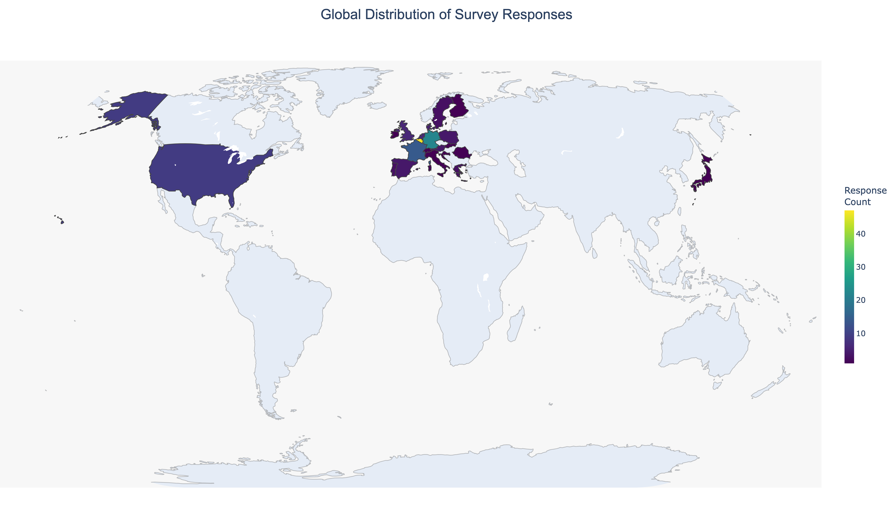
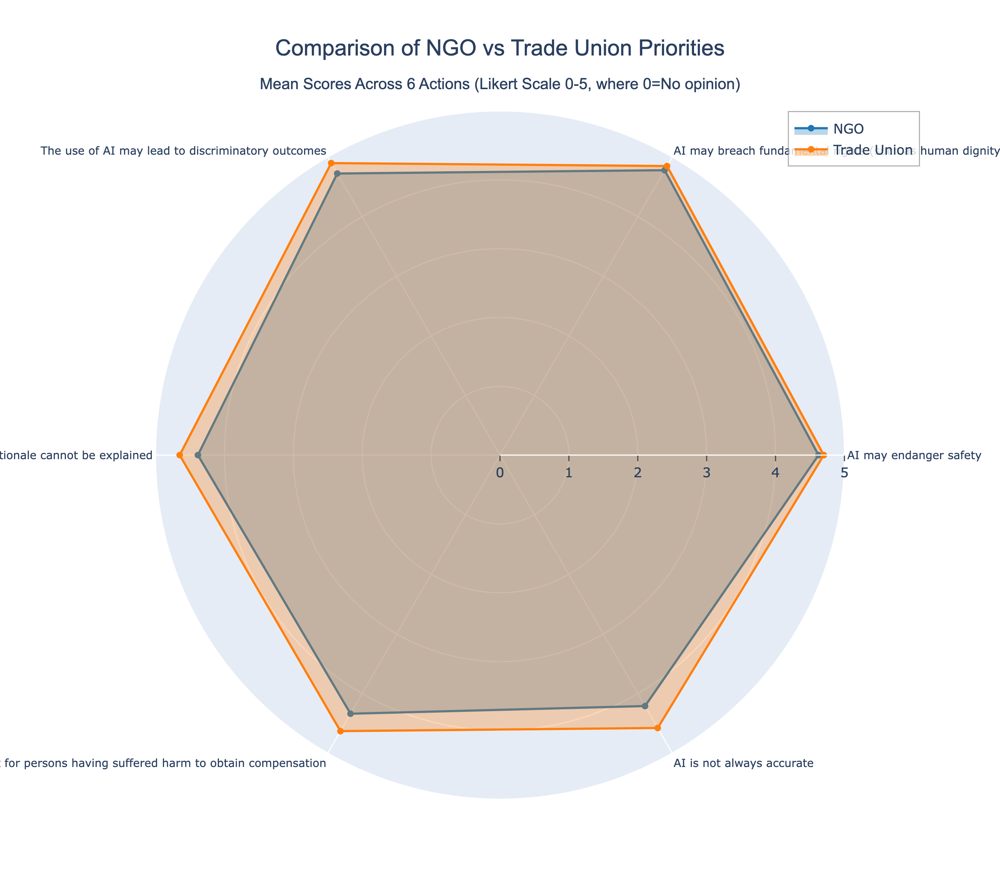
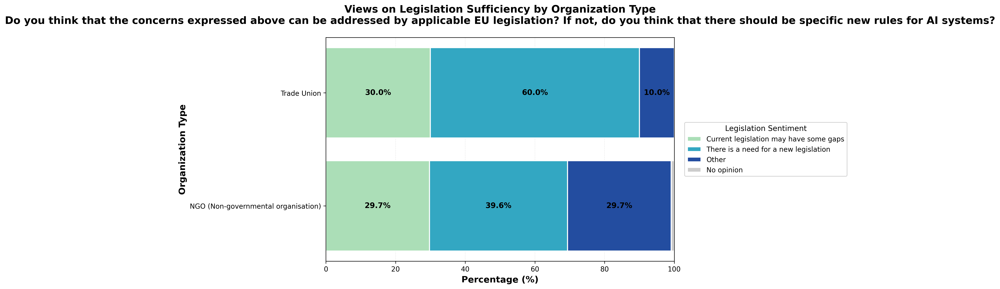
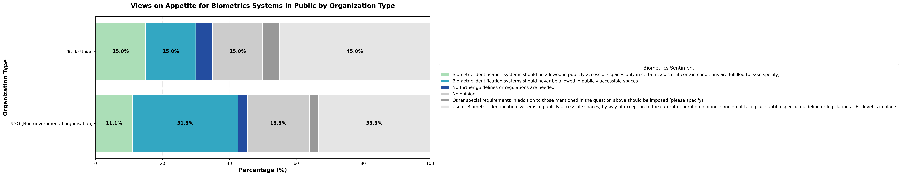

# EU AI Act Consultation Analysis

A comprehensive data analysis project examining stakeholder perspectives on the European Union's AI Act consultation, featuring machine learning topic modeling, statistical analysis, and interactive data visualizations.

## Overview

This project analyzes responses from the EU's 2020 public consultation on Artificial Intelligence regulation (Publication ID: 14488), with a specific focus on comparing perspectives between **NGOs** and **Trade Unions**. The analysis combines quantitative survey data (Likert scale responses) with qualitative text analysis (open-ended responses) to identify key priorities, concerns, and policy preferences among civil society stakeholders.

## Key Features

### Data Analysis
- **Survey Response Processing**: Analysis of 32+ Likert scale questions across multiple policy dimensions
- **Geographic Distribution**: Mapping of consultation responses across EU member states, USA, and other regions
- **Stakeholder Comparison**: Comparative analysis of NGO vs Trade Union priorities and sentiment
- **Statistical Analysis**: Contingency tables, priority gap analysis, and mean score calculations

### Machine Learning
- **Topic Modeling**: BERTopic implementation using multilingual sentence transformers (`paraphrase-multilingual-MiniLM-L12-v2`)
- **Keyword Extraction**: CountVectorizer with bigram analysis and custom stop words for European policy text
- **Text Analysis**: Processing of 9 open-ended survey response fields with NLP techniques

### Data Visualizations
- **Geographic Choropleth Maps**: World maps showing consultation participation by country and organization type
- **Radar Charts**: Multi-dimensional comparison of NGO vs Trade Union policy priorities
- **Stacked Bar Charts**: Categorical sentiment analysis across policy domains:
  - AI Legislation Sentiment
  - New Rules for AI Systems
  - Approach to High-Risk AI Applications
  - Biometric Identification
  - EU Values and Fundamental Rights
  - Legal AI Applications
  - Risk Assessment Frameworks
  - EU Legislation Updates

All visualizations are exported as high-resolution PNG files (300 DPI) suitable for publication.

## Project Structure

```
eu-ai-act-consultation-analysis/
├── Phase1_Survey_Analysis.py          # Main analysis script (2,500+ lines)
│                                      # - BERTopic topic modeling
│                                      # - Plotly visualizations
│                                      # - Statistical analysis
├── EUAI_phase1_v1.py                  # Data processing & PDF organization
├── EUAI_phase2_v1.py                  # API exploration for Phase 2 data
├── visualizations/                    # Generated charts and maps
│   ├── world_map_survey_responses.png
│   ├── world_map_by_org_type.png
│   ├── S2EOT2_radar_chart_ngo_vs_trade_union.png
│   ├── S2EOT2_stacked_bar_legislation_sentiment.png
│   └── ... (13 visualizations total)
└── notebooks/                         # Jupyter notebook examples
    └── example_analysis.ipynb
```

## Installation

### Prerequisites
```bash
pip install pandas numpy plotly bertopic sentence-transformers
pip install scikit-learn pycountry openpyxl xlsxwriter
```

### Data Collection
This project uses data collected via the [haveyoursay-analysis](https://github.com/spunfromsun/haveyoursay-analysis) toolkit, a standalone tool for fetching EU "Have Your Say" consultation data.

```bash
# Install the data collection toolkit
pip install git+https://github.com/spunfromsun/haveyoursay-analysis.git

# Fetch consultation data
haveyoursay-analysis fetch --publication-id 14488 --out data/phase1
haveyoursay-analysis download --attachments-csv data/phase1/attachments.csv --out data/phase1/files
```

## Usage

### Running the Full Analysis
```bash
python Phase1_Survey_Analysis.py
```

This script will:
1. Load and clean survey data from Excel files
2. Perform data mapping and Likert scale conversion
3. Generate geographic distribution maps
4. Create radar charts comparing stakeholder priorities
5. Run BERTopic topic modeling on open-ended responses
6. Export all visualizations to the `visualizations/` folder

### Interactive Notebook Example
See `notebooks/example_analysis.ipynb` for an interactive walkthrough with visible outputs.

## Analysis Highlights

### Survey Sections Analyzed
- **Section 1**: Importance of AI Actions (S1EOE1)
- **Section 2**: AI Regulation Perspectives
  - Legislation approaches (S2EOT2)
  - New rules for AI systems (S2EOT3)
  - High-risk AI applications (S2EOT4)
  - Regulatory frameworks (S2EOT5)
  - Biometric identification (S2EOT6)
  - EU values and fundamental rights (S2EOT8)
- **Section 3**: Specific Legal Interventions
  - Legal AI applications (S3SLI1)
  - Risk assessment frameworks (S3SLI2)
  - Updating EU legislation (S3SLI3)

### Key Findings
The analysis reveals systematic differences in policy priorities between NGOs and Trade Unions across multiple dimensions of AI regulation, particularly regarding:
- Risk assessment frameworks for high-risk AI systems
- Biometric identification and surveillance
- Protection of fundamental rights and EU values
- Legal frameworks for AI deployment

## Visualizations

<table>
<tr>
<td width="50%">

**Geographic Distribution**


</td>
<td width="50%">

**Stakeholder Comparison**


</td>
</tr>
<tr>
<td>

**Legislation Sentiment**


</td>
<td>

**Biometrics Sentiment**


</td>
</tr>
</table>

## Technical Details

### Data Processing
- **Encoding Handling**: Automatic detection and conversion of Windows-1252 encoded files
- **Missing Data**: Intelligent handling of "No opinion" responses and empty fields
- **Data Mapping**: Column renaming based on external mapping files for readability
- **PDF Organization**: Automated extraction and organization of stakeholder attachments

### Machine Learning Pipeline
1. **Text Preprocessing**: Cleaning and normalization of multilingual text
2. **Embedding Generation**: Sentence transformer embeddings for semantic similarity
3. **Topic Extraction**: BERTopic clustering with configurable parameters
4. **Keyword Analysis**: TF-IDF and CountVectorizer for term importance

### Visualization Stack
- **Plotly**: Interactive choropleth maps and charts
- **Pandas**: Data manipulation and aggregation
- **NumPy**: Statistical calculations
- **Custom Color Schemes**: Consistent styling across all visualizations

## Data Sources

This analysis uses data from the European Commission's "Have Your Say" platform:
- **Consultation**: Artificial Intelligence - ethical and legal requirements
- **Publication ID**: 14488
- **Period**: 2020 AI Act consultation (Phase 1)
- **API Endpoint**: `https://ec.europa.eu/info/law/better-regulation/api/allFeedback`

## Acknowledgments

This project was built using the [haveyoursay-analysis](https://github.com/spunfromsun/haveyoursay-analysis) toolkit for data collection. The toolkit provides a modern, lightweight approach to fetching EU consultation data with CLI commands and Docker support.

## License

This project is for research and educational purposes. The consultation data is publicly available from the European Commission's Better Regulation portal.

## Future Work

- **Phase 2 Analysis**: Extend analysis to later consultation phases
- **Cross-Phase Comparison**: Track evolution of stakeholder perspectives over time
- **Attachment Analysis**: Text extraction and analysis of PDF submissions
- **Interactive Dashboard**: Web-based visualization dashboard for exploratory analysis
- **Multilingual NLP**: Enhanced language-specific topic modeling for non-English responses

## Contact

For questions about this analysis or collaboration opportunities, please open an issue or submit a pull request.

---

**Built with:** Python, Pandas, Plotly, BERTopic, Sentence Transformers, scikit-learn
